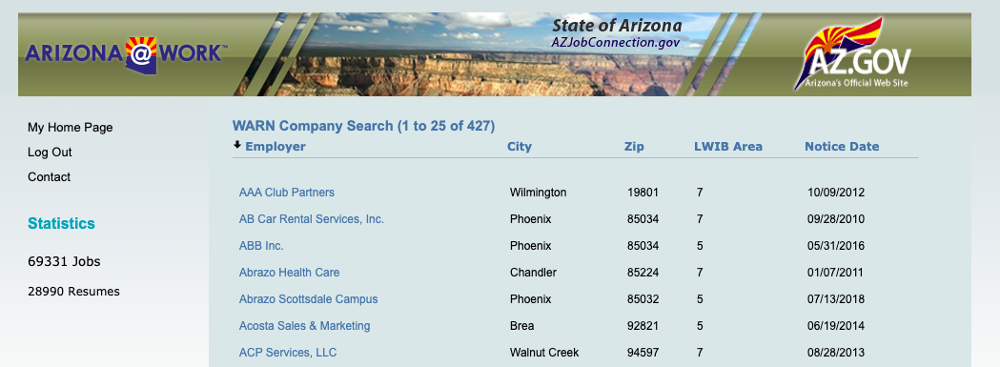
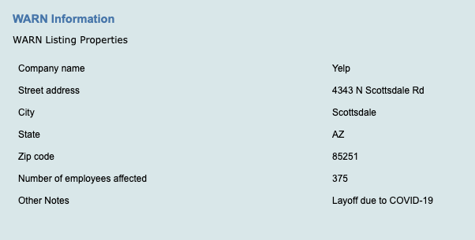
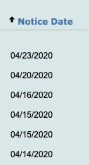

```{r, include=FALSE, message=FALSE}

# load libraries before we begin
library(tidyverse)        # for everything! 
library(rvest)            # this is to read the html files.
library(lubridate)        # this is to convert text to dates
library(knitrBootstrap)   # for pretty themes

```


## Scraping in the time of coronavirus

By late March, two weeks into the official pandemic, requests for unemployment assistance were setting records in Arizona. Gov. Doug Ducey issued orders to "stay home, stay healthy, stay connected" on March 30, and most restaurants and stores had closed down. Still, it was unclear which industries and employers were laying off workers due to covid-19.

This walkthrough gathers the data to help answer that question via a scraping exercise in R. We'll go from a clunky government website to a single data table that shows the business impact, still ongoing, of coronavirus over time.

### WARN listings

Companies that have at least 100 employees are required by law to submit notices to the state under the Worker Adjustment and Retraining Notification (WARN) Act. There are other specifics under the law, but the 100-employee rule broadly holds - and some companies with less than 100 employees issue notices, too. WARN does not apply to government agencies.

Here's how the state organizes listings online:



The website makes it difficult to get data. Every row links to a new page with details about how many people were laid off at the company, but there's no bulk download button. To collect data on a large scale, we'd have to undertake a lot of time-consuming, error-prone clicking around. 




But before we jump into scraping, let's examine the URL and the underlying data. 

https://www.azjobconnection.gov/ada/mn_warn_dsp.cfm?securitysys=on&start_row=26&max_rows=25&orderby=employer&choice=1

When I page through the site, I see that a maximum of 25 layoff notices can be displayed at one time. The URL makes that clear: `max_rows` is set to 25. With some websites, typing over the 25 with a larger number will trick the system to display all the data, but here it doesn't work. The website appears to be one giant table divided into 25-row sections: Page 2 shows rows 26-50, for example, page 3 shows 51-75, and so on. 

As of April 13, 2020, there are 420 rows - 420 layoff notices - spread over 17 pages.

Though we can't trick the website into displaying all the data at once, we can manipulate other keys in the URL. 

Note the different equals signs in the webite address. Isolated, they are: 

```{r, eval = FALSE}

securitysys = on
start_row = 26
max_rows = 25
orderby = employer
choice = 1

```

Right now, the data is sorted by employer name. I'll double-click the `Notice Date` column to make sure the most recent layoffs are shown first. This changes the `orderby` field to equal `noticeDateSort%20DESC`, which will be useful later on. When we come back to this exercise, for example, we might scrape only the most recent results.



Now, with a better understanding of the website's structure, we can get ready to scrape.

### Plan of attack

We'll scrape the site in two parts: 

* First, we'll scrape the data on the outer 'shell' of the website - including the hyperlinks that take us to details on the layoffs
* Second, we'll scrape the detailed listings for extra information - such as how many employees are affected 

## Part 1: Scraping the first layer of data

### Downloading

We'll tackle this in a loop, one page at a time.

But first, let's do a test run on a single page of results. Notice how we can manipulate the URL: I'll set the `start_row` equal to `1` and change the `orderby` header to sort descending by date.

```{r, eval = FALSE, message = FALSE}

download.file( "https://www.azjobconnection.gov/ada/mn_warn_dsp.cfm?securitysys=on&start_row=1&max_rows=25&orderby=noticeDateSort%20DESC&choice=1", 
               "warn_listing/page001.html" )

```

If there's no error message, we should be in the clear. We can now write a loop to download all 17 pages of data, pausing for 1 second between each request.

On each iteration of the code, we need only to change the `start_row`; everything else in the URL can stay the same. The code below shows how that works, saving each page to a folder called `warn_listing`:

```{r, eval = FALSE, message = FALSE}

url <- "https://www.azjobconnection.gov/ada/mn_warn_dsp.cfm?securitysys=on&start_row=1&max_rows=25&orderby=noticeDateSort%20DESC&choice=1"

# Get the pages, starting at page 2 since we saved the first page in the last step:
      for (p in  2:17) {
          
          # set new start row
          new_start_row <- ( (p-1) * 25 + 1 ) 
          
          # build the url by using str_replace for start_row=1 
          new_url <- str_replace( url, 
                                  "(start_row=)(1)", # regex pattern
                                  paste0( "\\1", new_start_row ) ) # replacement 
          download.file (new_url, 
                         paste0 ( "warn_listing/page", 
                                  sprintf( "%03d", p ),
                                 ".html" ),
                         method="auto" )
          Sys.sleep( 1 )
          
      }

```

### Parsing the data - setup

The next task is to parse the data on every saved html file using the rvest package. Here's how that might look on a single page, step by step:

```{r}

# read in a single page
my_html <- read_html( "warn_listing/page001.html" )

# convert html page to a series of tree-like nodes
all_rows <- html_nodes( my_html, xpath='//div[2]/table/tr' )

```

Get the 'children' of the html nodes, by row, to get a feel for how the data is organized. Rows one and two didn't return any table elements, but on row three we see the first sign of data:
```{r}

html_children( all_rows[ 3 ] ) # now we see <td> elements, or cells in a table

```

We can start looking for data one column at a time.
```{r}

n = length( all_rows )
data_rows <- all_rows[ 3:n ]

# use xpath to access the first column of data <td>
html_node( data_rows[ 1 ], xpath = 'td[1]' ) %>% html_text( )

```

Note: `html_table( )` is another neat command in rvest that converts html tables into dataframes. But since we need to get the URL in each row manually, it doesn't save us any time - we may as  well parse every column.

### Parsing the data in a loop
We can automate the data parsing now that we understand how to access the data in each column.

Begin by creating a table to hold our results:
```{r}

# define parent url
parent_url <- "https://www.azjobconnection.gov/ada/"

# define data frame
row_data <- tibble(
  
  page_num = character( ),
  row_num = numeric( ),
  full_link = character( ),
  company = character( ),
  co_hq_city = character( ),
  co_hq_zip = character( ),
  labor_area = character( ),
  notice_date_txt = character( )
  
)

```

Now begin the loop.

```{r}

# iterate through 17 html pages
for ( p in 1:17 ) {
  
  # parse page items
  my_html = read_html( paste0 ( "warn_listing/page", sprintf( "%03d", p ), ".html" ) )
  
  all_rows <- html_nodes( my_html, xpath = '//div[2]/table/tr' )
  
  n = length( all_rows )
  
  data_rows = all_rows[ 3:n ]
  
  new_start_row <- ( (p-1) * 25 + 1 ) 
  
  num_data_rows <- length( data_rows )
  
  # parse data_rows - begins at a multiple of 25 (plus 1)
  for ( i in 1:num_data_rows ) {
  
    j <- new_start_row + i - 1
    
    row_data[ j, 1 ] <- paste0 ("page", sprintf( "%03d", p ), ".html") # col 1 = page_num
      
    row_data[ j, 2 ] <- j # col 2 = row_num
      
    # quick two-step URL extraction
    row_url <- html_node( data_rows[ i ], xpath = "td[1]/span/a/@href" ) %>% html_text( )
    
    row_data[ j, 3 ]  <- paste0( parent_url, str_extract( row_url, "^.{16}(id=)\\d{1,4}" ) ) # col 3 = full_link
      
    row_data[ j, 4 ] <- html_node( data_rows[ i ], xpath = "td[1]" ) %>% html_text( ) # col 4 = company
      
    row_data[ j, 5 ] <- html_node( data_rows[ i ], xpath = "td[2]" ) %>% html_text( ) # col 5 = co_hq_city
      
    row_data[ j, 6 ] <- html_node( data_rows[ i ], xpath = "td[3]" ) %>% html_text( ) # col 6 = co_hq_zip
      
    row_data[ j, 7 ] <- html_node( data_rows[ i ], xpath = "td[4]" ) %>% html_text( ) # col 7 = labor_area
      
    row_data[ j, 8 ] <- html_node( data_rows[ i ], xpath="td[5]" ) %>% html_text( ) # col 8 = notice_date_txt
      
  } 
  
  # ta-da!
  
}

```
*Note: The loop range is hard coded as 1:17 here based on my visual analysis of the website. In a future iteration of this code, I would automate that process.*

A little bit of clean-up:
```{r}

# add an id column + make the date column a datetime datatype

warn_data <- row_data %>% 
    mutate( id = str_extract( full_link, "\\d{1,4}"),
            notice_date = mdy( notice_date_txt ) ) %>% 
    select( -notice_date_txt )

```

And don't forget to save the results!
```{r, warning = FALSE, message = FALSE}

# save without overwriting past results
date_curr = today( )

dir.create( paste0(
  "output/",
  date_curr ) ) 

save_location = paste0(
  "output/",
  date_curr,
  "/warn_data.csv"
)

write_csv( warn_data, save_location )

```

Half our work is done. Now let's prep for the next step: scraping data from the detailed WARN notices. These are stored in a separate list of URLs and conveniently saved in our `warn_data` table in the `full_link` column.

## Part 2: Scraping the detailed layoff data

### Downloading

First, create a table with all the hyperlinks we saved.
```{r}

company_url <- row_data %>% select( full_link )

```

Similar to before, we can write a loop to download these webpages. We'll iterate through our list of links, and save the page with a filepath that reflects the WARN ID. Here, since we have 420 requests instead of 17, I've shortened the 'sleeping' window to 0.75 seconds.

```{r, eval = FALSE, message = FALSE }

end <- nrow( company_url )

for ( u in 1:end ) {

  my_url <- company_url[ u, 1 ] %>% as.character( )
  
  id <- str_extract( my_url, '(id=)\\d{1,4}' )
  
  download.file( my_url, 
                 paste0 ( "company_urls/warn/", id ), method = "auto" )
  
  Sys.sleep( 0.75 )
  
}

```

### Parsing the data in a loop

On this task, we don't need to do any manual parsing - so `html_table( )` will be a big help. All we have to do is pivot the parsed data and add an `id` column.

One additonal challenge is that we can't walk through the pages in a sequential order as we did before, since the pages are saved according to their WARN ID. We can get around that using `list.files( )`, which lets us iterate through all the html files in the folder.

Just as before, let's create a table to hold the data:
```{r}

# define data frame
warn_detail <- tibble(
  
  page_name = character( ),
  row_num = numeric( ),
  id = character( ),
  company = character( ),
  co_st_address = character( ),
  co_hq_city = character( ),
  co_hq_state = character( ),
  co_hq_zip = character( ),
  num_employees_affected = numeric( ),
  other_notes = character( )
  
)

```

Now begin the loop to parse the data. We'll store it in a table called `warn_detail`.
```{r}

# create a list of files
file_list <- list.files( path= "company_urls/warn" )

n <- length( file_list )

# loop through every scraped file to parse the data
for (i in 1:n ) {
  
  file_name <- file_list[ i ] %>% as.character( )
  
  my_html <- read_html( paste0( "company_urls/warn/", file_name ) )
  
  my_table <- html_table( html_nodes( my_html, "table" )[[2]])
  
  table_length <- nrow( my_table )
  
  # account for layoff notices that don't have "Other Notes"
  if( table_length < 7 ) {
    r = tribble( 
      ~X1, ~X2,
      "Other Notes", "" )
    
    my_table <- bind_rows( my_table, r )
  }
  
  warn_row <- my_table %>%
    pivot_wider( names_from = X1, values_from = X2 ) %>%
    mutate(
      id = str_extract(file_name, "\\d{1,4}"),
      page_name = file_name,
      row_num = i,
      num_employees_affected = `Number of employees affected` %>% as.numeric( ),
      other_notes = `Other Notes`
    ) %>% 
    
    # re-order and rename columns to match data-frame
    select(
      page_name, 
      row_num, 
      id, 
      company = `Company name`,
      co_st_address = `Street address`,
      co_hq_city = `City`,
      co_hq_state = `State`,
      co_hq_zip = `Zip code`,
      num_employees_affected,
      other_notes
    )
  
  warn_detail <- bind_rows( warn_detail, warn_row  )
  
}

# done!

```

Save the results as a csv:

```{r}

date_curr = today( )

save_location = paste0(
  "output/",
  date_curr,
  "/warn_detail.csv"
)

write_csv( warn_detail, save_location )

```

## Review

Let's combine the two sets of data - `warn_data` and `warn_detail` into one table about layoffs.
```{r}

warn_data_complete <- warn_data %>% 
  left_join( warn_detail, by = c( "id" = "id" ) ) %>% 
  select(
    id,
    results_page = page_num, # page number of results on WARN website
    page_name, # id number within URL for detailed WARN
    full_link,
    company = company.x,
    co_hq_city = co_hq_city.x,
    co_hq_state,
    co_hq_zip = co_hq_zip.x,
    labor_area,
    notice_date,
    num_employees_affected,
    other_notes
  )

# save 
save_location = paste0(
  "output/",
  date_curr,
  "/warn_data_complete.csv"
)

write_csv( warn_data_complete, save_location )

```
 
We're done. Now, we have over 400 records of layoff notices dating back to 2010, which is when the first notice was posted online. We can group them together by month and year.

Below is a list of monthly layoffs, ranked by most employees impacted. March 2020 tops the list by far; April is second on the list, though it's only halfway through. Putting the two months together, we can estimate that about 9,000 people have been impacted by layoffs or furloughs in Arizona since covid-19 sparked a pandemic. It's a sobering record — and one that still leaves out entrepreneurs, small businesses and government employees on furlough.

``` {r }

warn_data_complete %>% 
  mutate( m = month( notice_date ),
          y = year( notice_date ),
          mo_yr = paste(m, y, sep = "-" ) ) %>% 
  group_by( mo_yr ) %>%
  summarise(
    notices = n( ),
    distinct_companies = n_distinct( company ),
    employees_affected = sum( num_employees_affected )
  ) %>% 
  arrange( desc( distinct_companies ) ) %>% 
  head( )

```

Which companies have issued the most layoffs due to coronavirus?
```{r}

warn_data_complete %>% 
  filter( str_detect( other_notes, "covid|coronavirus|Covid|Coronavirus|COVID" ) ) %>% 
  select( company, co_hq_city, co_hq_state, notice_date, num_employees_affected ) %>% 
  arrange( desc( num_employees_affected ) ) %>% 
  head( 10 )

```

There's so much more to analyze - but for now, we'll adjourn.

## Credits, caveats and next steps

Sarah Cohen generously got me started on this by sharing code that took through me most of Part 1. I used what I learned from reading her code to write Part 2 and assemble this tutorial.

The Arizona Deptartment of Economic Security also has an online listing of "non-WARN" notices — companies not bound by the WARN Act but who choose to submit layoff notices to the state anyhow. They are issued much less frequently, and this analysis excludes them.

It's worth noting, too, that while March and April are record-setting months for layoffs in our dataset, we don't have online records going back to the housing crash of 2008. With this data alone, we can't tell how these numbers compare to the last great recession.

Finally, this code-through is written as a one-time exercise, but it would be helpful to have another script that scrapes only the most recent layoffs and discards any duplicates already stored. Or, one that scrapes automatically when it detects a website change. That would save me and the server some time.

